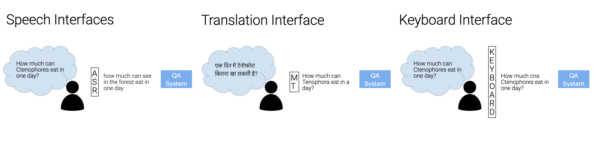

# NoiseQA

[NoiseQA](https://noiseqa.github.io/) is an example dataset for evaluating QA model robustness to interface noise.
The dataset consists of a subset of 240 paragraphs and 1190 question-answer pairs from
the development set of SQuAD v1.1 [(Rajpurkar et al., 2016)](https://www.aclweb.org/anthology/D16-1264/), as sampled in XQuAD [](https://arxiv.org/abs/1910.11856). The NoiseQA dataset introduces three different types of noise to each of these questions:
 - Machine Translation noise, to simulate errors occurring when users ask questions in a different language than the language(s) the QA model was trained on;
 - Keyboard noise, to simulate the effect of users making spelling errors while typing questions into the QA model;
 - ASR noise, to simulate speech recognition errors occurring when users interact with the QA system through a voice interface. 

For more information on how each dataset was created, please refer to our paper,
[NoiseQA: Challenge Set Evaluation for User-Centric Question Answering](https://arxiv.org/abs/2102.08345).

All files are in JSON format and follow the original SQuAD dataset file format. The image below shows a parallel example from NoiseQA, where the same question is distorted by the three types of interface noise.



## Data
The repository consists of three directories:
- #### Synthetic

  This directory contains challenge sets with generated synthetic noise, as described in the paper:
  - ASR Noise: `xquad-asr-synthetic.json`
  - Translation Noise: `xquad-translation-synthetic.json`
  - Keyboard Noise: `xquad-keyboard-synthetic.json`

- #### Natural

  This directory contains challenge sets with collected natural noise, as described in the paper:
  - ASR Noise: `xquad-asr-natural.json`
  - Translation Noise: `xquad-translation-natural.json`
  - Keyboard Noise: `xquad-keyboard-natural.json`


For both synthetic and natural noise, translation noise is sourced from German. Translation noise from nine other languages can be found in the Translation directory.
- #### Translation
  
  This directory contains files in the following languages, based on translated queries from the XQuAD dataset, injected with translation noise when converted to English:
  - Arabic: `xquad-context-en-question-ar.json`
  - German: `xquad-context-en-question-de.json`
  - Greek: `xquad-context-en-question-el.json`
  - Spanish: `xquad-context-en-question-es.json`
  - Hindi: `xquad-context-en-question-hi.json`
  - Russian: `xquad-context-en-question-ru.json`
  - Thai: `xquad-context-en-question-th.json`
  - Turkish: `xquad-context-en-question-tr.json`
  - Vietnamese: `xquad-context-en-question-vi.json`
  - Chinese: `xquad-context-en-question-zh.json`

As the dataset is based on SQuAD v1.1, there are no unanswerable questions in the data; we chose this
setting to isolate the effect of interface noise from other challenging confounds.

## Training and evaluation

In order to evaluate on NoiseQA, models should be trained on the SQuAD v1.1 training file. which can be
downloaded [here](https://github.com/rajpurkar/SQuAD-explorer/blob/master/dataset/train-v1.1.json). 
Model validation similarly can be conducted on the SQuAD v1.1 validation file, or a synthetically noised validation set (such as those in NoiseQA-synthetic) depending on which usage scenario is being emulated. Final testing should ideally be performed on a natural test set if available (such as those in NoiseQA-natural).


## Future Evaluations

Individual practitioners would seek to develop challenge evaluations based on their specific task requirements, for different resources, users, and real-world scenarios. If you do so, we would love to hear about it! Please feel free to open a Github Issue, and we will add a description and pointer to your resource in the repository and on the [NoiseQA website](https://noiseqa.github.io/).

## Reference

If you use this dataset, please cite [[1]](https://arxiv.org/abs/2102.08345):

[1] Ravichander, A., Dalmia, S., Ryskina, M., Metze, F., Hovy, E., & Black, A. (2021). [NoiseQA: Challenge Set Evaluation for User-Centric Question Answering](https://arxiv.org/abs/2102.08345), EACL 2021.

```
@inproceedings{ravichander2021noiseqa,
  title={{NoiseQA}: Challenge Set Evaluation for User-Centric Question Answering},
  author={Abhilasha Ravichander and Siddharth Dalmia and Maria Ryskina and Florian Metze and Eduard Hovy and Alan W Black},
  booktitle = {Conference of the European Chapter of the Association for Computational Linguistics (EACL)},
  address = {Online},
  month = {April},
  url={https://arxiv.org/abs/2102.08345},
  year={2021}
  }
```
